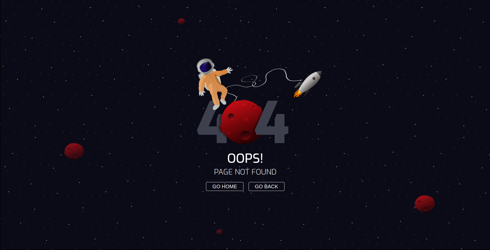

# Page 404 - Spaceman theme 🚀

project developed with [Vite](https://vitejs.dev/) template for [React & Typescript](https://react.dev/learn/typescript) stylized with [styles-components](https://styled-components.com/). 

Deploy with [Netlify](https://www.netlify.com/)

## React + TypeScript + Vite

This template provides a minimal setup to get React working in Vite with HMR and some ESLint rules.

Currently, two official plugins are available:

- [@vitejs/plugin-react](https://github.com/vitejs/vite-plugin-react/blob/main/packages/plugin-react/README.md) uses [Babel](https://babeljs.io/) for Fast Refresh
- [@vitejs/plugin-react-swc](https://github.com/vitejs/vite-plugin-react-swc) uses [SWC](https://swc.rs/) for Fast Refresh

## Usage

- download this project 
- go to **Page.tsx**
- copy the code and add all the imports in project. 
- don't forget to get dependencies and add to you package.json

    
## Autores

- developed by [@tamires-manhaes](https://www.github.com/octokatherine)
- design by [@seda](https://www.figma.com/@seda) in [Figma](https://www.figma.com/community/file/905820923924600579)
